# Solution Journal

## 1. Requirements and Analysis

_Time spent: 3 hours_

### 1.1. Objectives

* [x] Define the product scope 
* [x] Define the user stories
* [x] Define the features

See: [Problem Analysis](analysis.md)

### 1.2. References

- https://en.wikipedia.org/wiki/Software_development_process

## 2. Define Environment

_Time spent: 1 hour_

### 2.1. Objectives
* [x] Define the programming environment
* [x] Define standards for further contributions
* [x] Define the technology stack

### 2.2. Selection

| Category             | Details                   |
|----------------------|---------------------------|
| Programming Language | Python 3.12               |
| Containerization     | Docker 27.1               |
| Web Framework        | Django 5.1                |
| Python IDE           | PyCharm Community Edition |
| Code style           | PEP-8, Google Doc Strings |
| Linting              | PyCharm built-in linter   |
| Testing              | Unittest                  |
| Version Control      | Git                       |
| Git Hosting          | GitHub                    |
| CI/CD                | GitHub Actions            |
| Documentation        | GitHub Pages, MkDocs      |

## 3. Multi-Processing in Python

_Time spent: 7 hours for research, prototyping and implementation_

### 3.1. Objectives

* [x] Understand the key aspects of the `multiprocessing` module
* [x] Implement a prototype using the `multiprocessing` module


### 3.2. Prototyping

We will concentrate on the implementation of the solution based on the task 
definition. We will use the `multiprocessing` module to simulate multiple 
construction crews working on the wall.
 
The idea is to simulate a CPU bound task where each construction crew is working
to complete a task. In the end, we shall notice a performance improvement when
using multiple processes.

The multiprocessing module allows us to create multiple processes that run
in parallel. Each process will simulate a construction crew working on a
section of the wall. We will use the `Pool` class to create a pool of worker
processes that will work on the wall sections.

```python
from multiprocessing import Pool
import time
import os


def process_section(section):
    print(f"Processing section {section} in process {os.getpid()}")
    time.sleep(1)


def main():
    wall_profiles = [
        [10, 20],
        [10, 5],
        [20, 25]
    ]

    num_processes = 2

    # Get the sections
    sections = []
    for profile in wall_profiles:
        sections.extend(profile)

    # Do the work in parallel on the sections
    with Pool(num_processes) as pool:
        pool.map(process_section, sections)


if __name__ == "__main__":
    main()
```

The `Pool` class takes the number of worker processes as an argument. The 
most common way to create a pool of worker processes is to use the `map` 
method. The `map` method takes a function and an iterable as arguments. The 
function is applied to each element of the iterable using the worker 
processes in the pool.


Another possibility is to use the `starmap` method. The `starmap` method is
similar to the `map` method, but it takes iterable of iterables as an
argument. Each inner iterable is unpacked and passed as arguments to the
function.

```python
from multiprocessing import Pool
import time
import os


def process_section(section, step):
    print(f"Processing section {section} on step {step} in process {os.getpid()}")
    time.sleep(1)
    

def main():
    
    wall_profiles = [
        [10, 20],
        [10, 5],
        [20, 25]
    ]

    num_processes = 2

    # Get the sections
    sections = []
    for profile in wall_profiles:
        sections.extend(profile)

    # Parallel execution of the sections with arguments
    with Pool(num_processes) as pool:
        pool.starmap(process_section, [(section, 1) for section in sections])

if __name__ == "__main__":
    main()
```

### 3.3. References

- https://pymotw.com/3/multiprocessing/index.html
- https://docs.python.org/3/library/multiprocessing.html
- https://superfastpython.com/multiprocessing-in-python/

## 4. Logging with Multiprocessing

_Time spent: 2 hours for reading, prototyping and implementation_

### 4.1. Objectives

* [x] Understand the challenges of logging in a multiprocess environment
* [x] Implement a prototype using the `multiprocessing` module

### 4.2. Challenges

_Although logging is thread-safe, and logging to a single file from 
multiple threads in a single process is supported, logging to a single 
file from multiple processes is not supported. There is no 
standard way to serialize access to a single file across multiple 
processes in Python._

See:

- https://docs.python.org/3/howto/logging-cookbook.html#logging-to-a-single-file-from-multiple-processes


### 4.3. Solution

One solution to this problem is to use a `Queue` to pass log messages from the
worker processes to a single process that will write the log messages to a file.
The queue will be handled by a separate process that will read log messages from
the queue and write them to a log file.

The `multi_process_logging.py` script contains the implementation of the 
solution. The script uses a queue and a `QueueHandler` that will push the 
log messages to the queue. The `LogListener`process will get the log 
messages from the queue and write them to a file. The file name is fixed in 
the script (pool_logging.log).

Source: [/scripts/multi_process_logging.py](snippets/multi_process_logging.md)

### 4.4. References
- https://stackoverflow.com/questions/13522177/python-multiprocessing-logging-why-multiprocessing-get-logger
- https://pymotw.com/3/multiprocessing/basics.html#logging
- https://docs.python.org/3/library/logging.handlers.html#queuehandler
- https://github.com/getsentry/sentry-python

## 5. Proof of Concept

_Time spent: 4 hours for implementation and testing_

### 5.1. Objectives

* [x] Define the proof of concept
* [x] Create a working prototype of the solution with logging
* [x] Test the prototype with different configurations
* [x] Simple positive tests to check the implementation


### 5.2. Definition

In this step, we will create a simple proof of concept to check our 
understanding of the problem. The prototype will be a simple Python 
script that takes the following arguments as python objects: 

- Configration list 
- Number of workers
- Days to calculate

The calculation (building the wall) delay will be simulated by a 
configurable sleep function. By increasing the number of worker processes, we
expect the calculations to be done faster. The total amount of ice and cost
is not affected by the number of workers.

### 5.3. Prototyping

Source: [/scripts/proof_of_concept.py](snippets/proof_of_concept.md)

## 6. Product Design

_Time spent: 4 hours for implementation_

### 6.1. Objectives

* [x] Define the project structure
* [x] Define diagrams for the system (C4 model)
* [x] Define the CI/CD pipeline

### 6.2. Define Project Structure

| Directory     | Description                                                  |
|---------------|--------------------------------------------------------------|
| builder/      | Contains the main implementation of the solution             |
| data/         | Contains the configuration and log files                     |
| docs/         | Contains the documentation for the project                   |
| profiles/     | Django app to track the progress of the construction crews   |
| scripts/      | Contains the scripts used to automate tasks, prototypes, etc |
| wall-project/ | Contains the Django project settings                         |


### 6.3. Create Design Diagrams


#### Proposal A: Modified Composite Pattern (chosen solution)
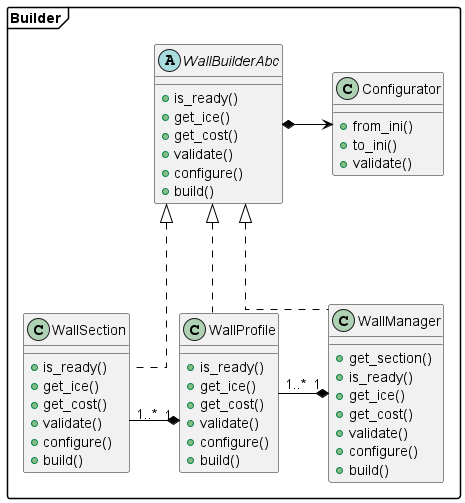

#### Proposal B: Builder Pattern (rejected)
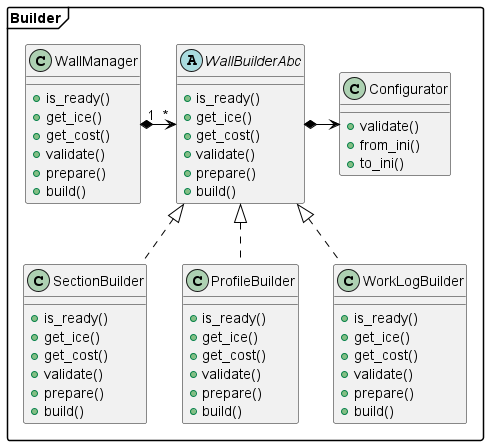

#### Data Models

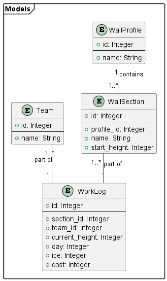

### 6.4. Define CI/CD Pipeline

- GitHub Actions to run the tests on every push to the main branch
- GitHub Actions to build and push the Docker image to Docker Hub
- GitHub Actions to build the documentation and deploy it to GitHub Pages

### 6.5. References
- https://en.wikipedia.org/wiki/C4_model
- https://c4model.com/img/c4-overview.png


## 7. Django REST API

_Time spent: 20 hours for implementation and testing_

### 7.1. Objectives

* [x] Create a django project
* [x] Create a django application
* [x] Add and route a 'Hello, World!' view
* [x] Add the required views and route them
* [x] Connect the views and the wall builder logic
* [x] Improve the builder manager
* [x] Allow configuration from the user
* [x] Allow access to the log file
* [x] Test the views


NOTES:

1. _This is an implementation of the MVP (minimum viable product) for the REST 
API. The API will be used to interact with the wall builder manager.
At this stage, we will not use the Django models and a database._


### 7.2. Create a Django project

A project is a collection of configurations and apps. One project can be 
composed of multiple apps or a single app. To create a new Django project, 
run the following command:

```text
django-admin startproject <replace_with_your_project_name>
```

### 7.3. Start the Django development server

Test the project by running the development server. The development server is
a lightweight web server included with Django. To start the development server, 
run the following command:

```text
python manage.py runserver 8080
```

The development server will start on [http://localhost:8080](http://localhost:8080)

### 7.4. Create a new Django app

An app usually is composed of a set of models (database tables), views, 
templates, tests.

| Category | Details                                                                                                                        |
|----------|--------------------------------------------------------------------------------------------------------------------------------|
| model    | A model is a Python class represents a database table.                                                                         | 
| view     | A view is a Python function that takes a web request and returns a web response.                                               |
| template | A template is an HTML file that contains placeholders for dynamic content.                                                     |

```text
python manage.py startapp <replace_with_your_app_name>
```

### 7.5. Add a 'Hello, World!' view

Create a view that returns a simple 'Hello, World!' message in the profiles
app.

```python
from django.http import HttpResponse

def home():
    return HttpResponse("Hello, World!")
```

Create a URL pattern that routes the view to the root URL.

```python
from django.urls import path
from profiles import views

urlpatterns = [
  path('', views.home, name='home'),
]
```


### 7.6. Add the required stub views and route them

Add the required views that will just echo the input data. The views will 
later connect to the wall builder manager.

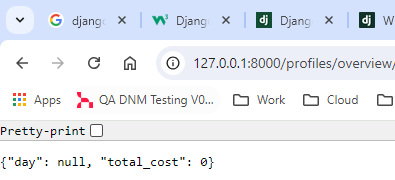
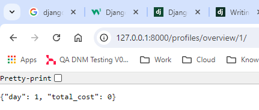
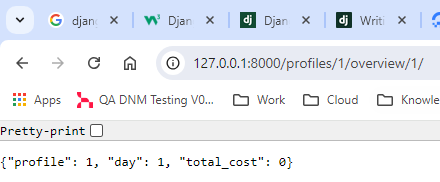
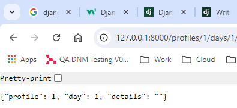

### 7.7. Connect the views to the wall builder logic

First, we will start to connect the views to the builder logic. As input, we
will take the example in the documentation:

```text
21 25 28
17
17 22 17 19 17
```

The expected output is:

```text
GET /profiles/1/days/1/
RETURNS: {
day: ”1”;
ice_amount: “585”
}

GET /profiles/1/overview/1/
RETURNS: {
day: ”1”;
cost: “1,111,500”
}

GET /profiles/overview/1/
RETURNS: {
day: ”1”;
cost: “3,334,500”
}

GET /profiles/overview/
RETURNS: {
day: None;
cost: “32,233,500”
}
```

Result: [assets/videos/rest_api_routing_test.mp4](assets/videos/rest_api_routing_test.mp4)

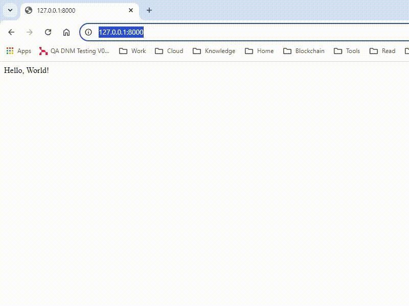


### 7.8. Improve the builder manager

After the integration of the views with the builder logic, we will improve the
builder manager based on some issues found during the previous steps.

- [x] Update both sections and profiles after each calculation
- [x] Add base exception class and extend the error hierarchy
- [x] Extend the interface to new requirements during the development
- [x] Add more unit tests to cover all relevant classes

NOTES:

1. _The unit tests are passing, but a process remains in the background after 
the tests are completed.The issue is related to the logging solution and more 
specifically when the main process logs to the logging queue._

2. _For now, the main process will not log to the queue to ensure successful unit tests. 
Further investigation is necessary to resolve the issue._

### 7.9. Allow configuration from the user

- [x] Handle exceptions in the views
- [x] WallConfigurator class that will import or export the wall configuration
- [x] Extend the REST API to allow the user to configure the wall
- [x] Handle the views with the Django REST framework
- [x] Add a route to get the wall log using the REST API
- [x] Provide unit tests for the views

NOTES:

1. _Either use a dedicated script or tools from the command line to test the
POST requests. A script `http_post.py` is provided in the `scripts` directory._
2. _Alternatively use the `Invoke-WebRequest` or `curl` commands from the 
command line._
3. _The test coverage of the views will cover only basic positive and negative
scenarios. The views will be tested with the Django test client._

### 7.10. References
- https://simpleisbetterthancomplex.com/series/beginners-guide/1.11/
- https://www.djangoproject.com/
- https://www.django-rest-framework.org/
- https://developer.mozilla.org/en-US/docs/Learn/Server-side/Django
- https://apiguide.readthedocs.io/en/latest/index.html
- https://stackoverflow.blog/2020/03/02/best-practices-for-rest-api-design/
- https://django.cowhite.com/blog/working-with-url-get-post-parameters-in-django/

 
## 8. Containerize the solution

_Time spent: 2 hours for implementation and testing_

### 8.1. Objectives

* [x] Create a Dockerfile
* [x] Build and run the Docker image
* [x] Test the container

NOTES:

1. _The solution will not be optimized for production. The goal is to create a 
single container that can be used for testing and development purposes._

### 8.2. Create a Dockerfile

The Dockerfile will be used to build the Docker image. The Docker image will
contain the Python environment and the Django project.

```dockerfile
# Python base image
FROM python:3.12.5-alpine3.19

# Define the working directory
WORKDIR ./usr/src/wall_project

# Copy the project files to the working directory
COPY . .

# Install the project dependencies
RUN pip install -r requirements.txt

# Expose the server port
EXPOSE 8000

# Run the Django development server
CMD ["python3", "manage.py", "runserver", "0.0.0.0:8000"]
```

### 8.3. Build and run the Docker image

Build the Docker image using the Dockerfile.

```text
docker build -t wall_project:latest .
```

Run the Docker image using the following command.

```text
docker run -p 8000:8000 wall_project:latest
```

### 8.4. Test the container

Test the container by navigating to http://localhost:8000 in your web browser.
The Django development server should be running, and you should see the Django
welcome page.

Result: [assets/videos/docker_rest_api_test.mp4](assets/videos/docker_rest_api_test.mp4)


### 8.5. References
- https://github.com/docker/awesome-compose/tree/master/django
- https://github.com/cyantarek/django-microservices/blob/master/services/products/api/views.py
- https://github.com/thejungwon/docker-webapp-django
- https://github.com/StephenGrider/microservices-casts
- https://github.com/dockersamples/link-shortener-django


## 9. Build the documentation pages

_Time spent: 1 hour_

### 9.1. Objectives

* [x] Create the documentation structure
* [x] Use MkDocs to build the documentation
* [x] Test locally the generated pages
 

### 9.2. Create the documentation structure

| File               | Description                         |
|--------------------|-------------------------------------|
| ./docs/index.md    | Project Overview                    |
| ./docs/problem.md  | Problem Statement                   |
| ./docs/solution.md | Solution Journal                    |
| ./docs/rest_api.md | Rest API Reference                  |
| ./CONTRIBUTING.md  | Contribution guidelines             |
| ./README.md        | Installation and usage instructions |


### 9.3. Use MkDocs to build the documentation

MkDocs is a static site generator that's geared towards building project
documentation. Documentation source files are written in Markdown, and
MkDocs builds a static HTML site that can be easily hosted on GitHub Pages.

```text
pip install mkdocs
```

We will also need the section-index plugin to generate a table of contents for
each page (see https://pypi.org/project/mkdocs-section-index/).

```text
pip install mkdocs-section-index
```

Create a new MkDocs project in the current directory. This will add a new
`mkdocs.yml` configuration file and a new `docs/` directory if they do not
already exist.

```text
mkdocs new .
```

As a next step populate the `docs/` directory with the documentation files.
After this open the `mkdocs.yml` file and update the `nav` section with the
new documentation files.

```yaml
site_name: "Wall Project Solution"

theme:
  name: "readthedocs"

nav:
    - Project:
      - Home: index.md
      - Problem Statement: problem.md
      - Solution Journal : solution.md
      - REST API Reference: rest_api.md

plugins:
- search
- section-index
```

Now the project is ready to build the documentation. Run the following command
to build the documentation.

```text
mkdocs build --site-dir build/pages
```

### 9.4. Test locally the generated pages

Run the following command to serve the documentation locally.

```text
mkdocs serve
```

Result: [assets/videos/mkdocs_test.mp4](assets/videos/mkdocs_test.mp4)

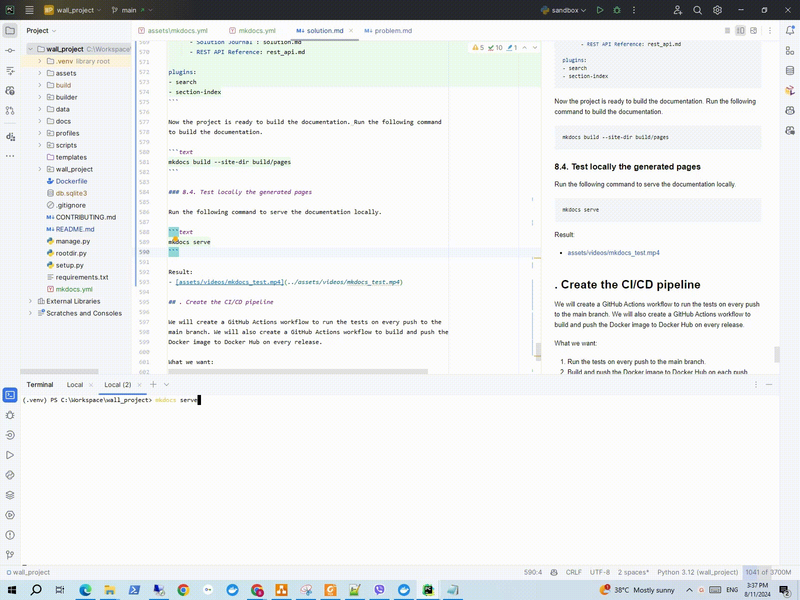

## 10. Create the CI/CD pipeline

_Time spent: 2 hours_

We will create a GitHub Actions workflow to run the tests on every push to the
main branch. We will also create a GitHub Actions workflow to build and push the
Docker image to Docker Hub on every release.

### 10.1. Objectives

- [x] Pipeline to build the documentation and deploy it to GitHub Pages
- [x] Pipeline to run the tests on every push to the main branch
- [x] Pipeline to build and push the Docker image to Docker Hub

### 10.2. GitHub Action to publish the documentation

Create a new GitHub Actions workflow file in the `.github/workflows` directory.
See the file [./.github/workflows/deploy_pages.yml](snippets/deploy_pages.md).

### 10.3. GitHub Action to run the tests

Create a new GitHub Actions workflow file in the `.github/workflows` directory.
See the file [./.github/workflows/run_tests.yml](snippets/run_tests.md).

### 10.4.GitHub Action to deploy the Docker image

Create a new GitHub Actions workflow file in the `.github/workflows` directory.
See the file [./.github/workflows/deploy_docker_image.yml](snippets/deploy_docker_image.md).

Add secrets to the GitHub repository to store the Docker Hub username and password.

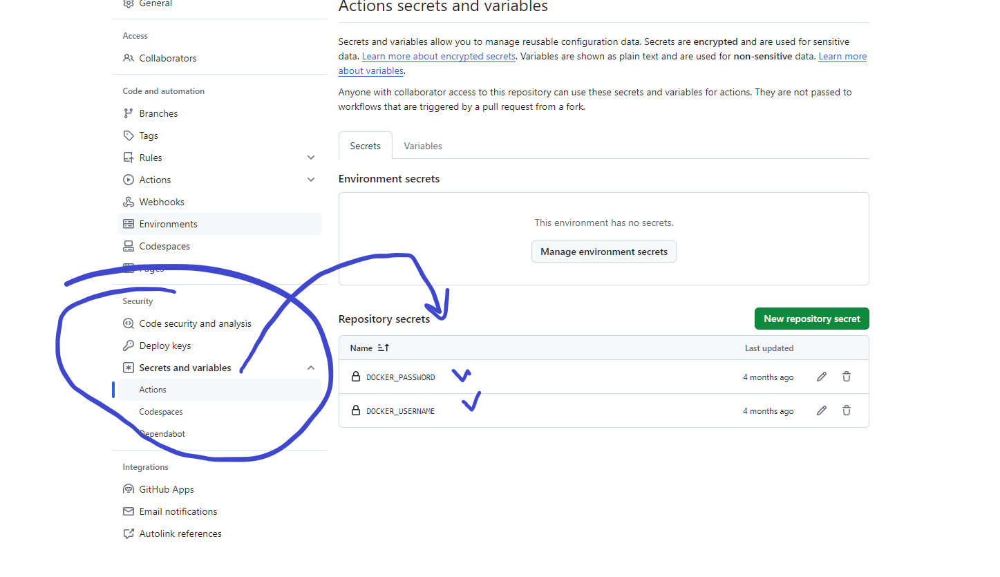

After the build the project is available on the Docker Hub. The link to the 
Docker Hub repository is: 

- [Wall Project Docker Hub Repository](https://hub.docker.com/repository/docker/braboj/wall_project)

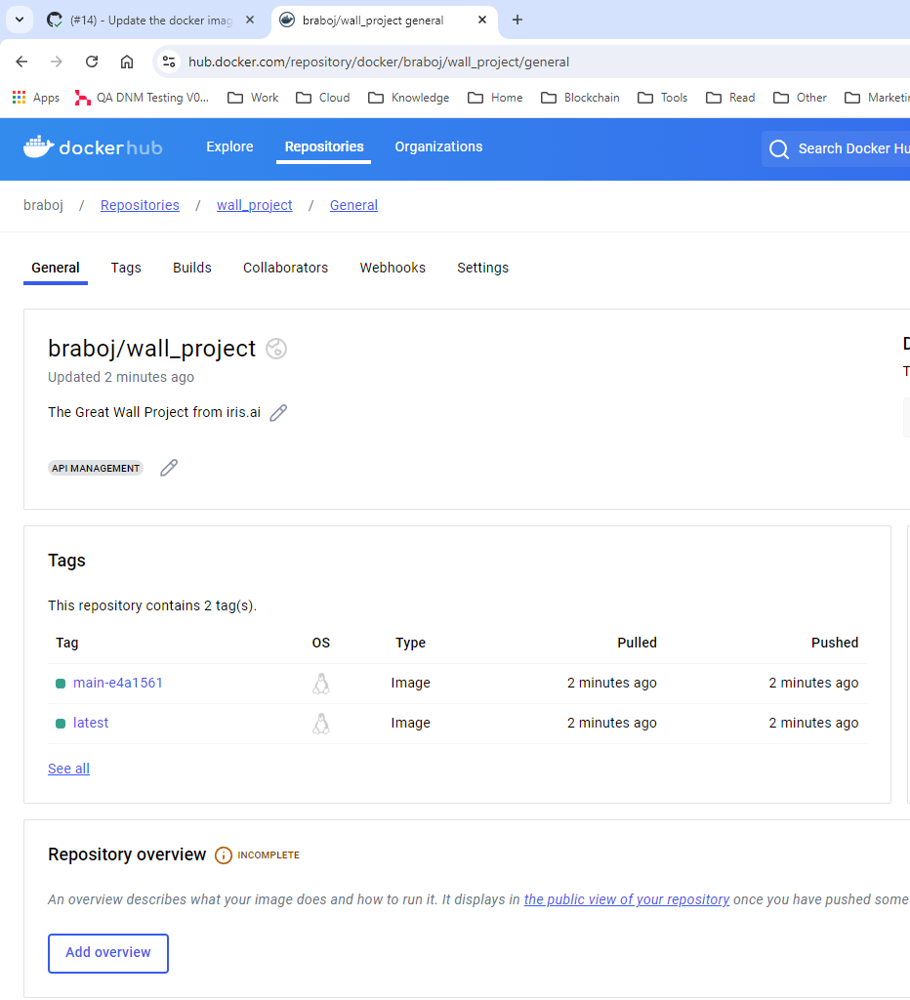

## 11. Review

_Time spent: 4 hours_

### 11.1. Objectives

- [x] Fix bug with worker reallocation
- [x] Add the models to the solution
- [x] Check the diagrams
- [x] Check the acceptance criteria

### 11.2. Fix bug with the worker reallocation

**Commits**

- [5ac4a48](https:///github.com/braboj/the-great-wall/commit/5ac4a48)
- [f53ef3a](https://github.com/braboj/the-great-wall/commit/f53ef3a)

**Problem**

The worker reallocation is not working as expected. The workers are not
reallocated to the next section after the current section is completed.

**Before fix**

```text
    Worker-2        - Added 1 foot to section 0 to reach 22 feet on day 1\n",
    Worker-2        - Added 1 foot to section 4 to reach 26 feet on day 9\n",
    Worker-2        - Added 1 foot to section 7 to reach 30 feet on day 11\n",
```

**After fix**

```text
2024-08-11 19:25:43,325 INFO     Worker-4        - Added 1 foot to section 3 to reach 18 feet on day 1
2024-08-11 19:25:43,436 INFO     Worker-4        - Added 1 foot to section 3 to reach 19 feet on day 2
2024-08-11 19:25:43,447 INFO     Worker-4        - Added 1 foot to section 3 to reach 20 feet on day 3
2024-08-11 19:25:43,458 INFO     Worker-4        - Added 1 foot to section 3 to reach 21 feet on day 4
2024-08-11 19:25:43,473 INFO     Worker-4        - Added 1 foot to section 3 to reach 22 feet on day 5
2024-08-11 19:25:43,484 INFO     Worker-4        - Added 1 foot to section 3 to reach 23 feet on day 6
2024-08-11 19:25:43,495 INFO     Worker-4        - Added 1 foot to section 3 to reach 24 feet on day 7
2024-08-11 19:25:43,539 INFO     Worker-4        - Added 1 foot to section 3 to reach 25 feet on day 8
2024-08-11 19:25:43,549 INFO     Worker-4        - Added 1 foot to section 3 to reach 26 feet on day 9
2024-08-11 19:25:43,559 INFO     Worker-4        - Added 1 foot to section 3 to reach 27 feet on day 10
2024-08-11 19:25:43,571 INFO     Worker-4        - Added 1 foot to section 3 to reach 28 feet on day 11
2024-08-11 19:25:43,581 INFO     Worker-4        - Added 1 foot to section 3 to reach 29 feet on day 12
2024-08-11 19:25:43,592 INFO     Worker-4        - Added 1 foot to section 3 to reach 30 feet on day 13
2024-08-11 19:25:43,603 INFO     Worker-4        - Added 1 foot to section 0 to reach 22 feet on day 1
2024-08-11 19:25:43,614 INFO     Worker-4        - Added 1 foot to section 0 to reach 23 feet on day 2
2024-08-11 19:25:43,625 INFO     Worker-4        - Added 1 foot to section 0 to reach 24 feet on day 3
2024-08-11 19:25:43,636 INFO     Worker-4        - Added 1 foot to section 0 to reach 25 feet on day 4
```

### 11.3. Add the models to the solution

First create a superuser to access the Django admin interface:

```text
python manage.py createsuperuser
```

The commands to interact with the Django models are:

```text
# Create the models
python manage.py makemigrations

# Apply the migrations
python manage.py migrate
```

The views can be registered in the `admin.py` file:

```python
from django.contrib import admin

# Register your models here.
from profiles.models import WallProfile, WallSection, Team, WorkLog

admin.site.register(WallProfile)
admin.site.register(WallSection)
admin.site.register(Team)
admin.site.register(WorkLog)
```

### 11.4. Check the acceptance criteria

The acceptance criteria are met. The solution is able to simulate the
construction of the wall using multiple construction crews. The solution
provides the required API endpoints to configure the wall and access the log
file.

The MVP acceptance criteria are:

- [x] Multiprocessing to simulate the construction of the wall
- [x] Models will be provided but not used (use only in-memory storage)
- [x] Builder and configuration components
- [x] Required tracking API endpoints
- [x] Endpoints to configure the application
- [x] Endpoints to access the log file
- [x] Dockerfile to build the image
- [x] Unit tests for the solution
- [x] Documentation

If possible, include the following extended features:

- [ ] Database persistence and models
- [ ] Class-based views for the endpoints
- [ ] Browsable API

### 11.5. Research the problem with deadlock on running the unit tests

It seems the current implementation of the logging solution is causing the
deadlock when running the unit tests. Maybe one of the processes waits 
indefinitely on one end of the queue if the other end is closed without
notification?

```python
import multiprocessing
import random
import time


class Worker(object):

    def build(self, queue):
        """Function to be executed in a worker process."""

        while True:

            # Simulate a computation delay
            time.sleep(0.01)

            # Put the result in the queue
            queue.put(random.random())

            break


class BuilderManager(object):

    @staticmethod
    def process_results(queue):
        """Function to process results from the queue."""
        while not queue.empty():
            result = queue.get()
            print(f"Result: {result}")

    def build(self):

        workers = [Worker() for _ in range(4)]

        # Create a manager and a shared queue
        with multiprocessing.Manager() as manager:

            queue = manager.Queue()

            # Create a pool of worker processes
            with multiprocessing.Pool(processes=4) as pool:

                # Use pool.starmap to map numbers to the worker function with the shared queue
                pool.starmap(
                    func=Worker.build,
                    iterable=[(worker, queue) for worker in workers]
                )

            # After all processes have completed, process the results
            self.process_results(queue)


def main():

    managers = [BuilderManager()] * 4
    for manager in managers:
        manager.build()


if __name__ == '__main__':
    main()
```

NOTES:

1. _Due to time constraints, the issue will be dropped for now. The solution 
will be tested in a future release._

See: 
- https://docs.python.org/2/library/multiprocessing.html#pipes-and-queues
- https://stackoverflow.com/questions/43439194/python-multiprocessing-queue-vs-multiprocessing-manager-queue
- https://cloudcity.io/blog/2019/02/27/things-i-wish-they-told-me-about-multiprocessing-in-python/


## 12. Retrospective

Skills improved during the project:

- Multiprocessing in Python
- Logging in a multiprocess environment
- Django and Django REST framework
- PlantUML for diagrams

Challenges faced during the project:

- Major release of another product, could not work after-hours
- Lost 3 days of work due to illness (coronavirus), could not implement
more features
- Problems with the queue logging solution in the unit tests, spent 5-6 hours 
to debug the issue. The workaround was to disable logging in the main process.

What would I do differently next time:

- Experiment and read more about multiprocessing + async programming
- Videos and animated gifs could be done better
- <...add feedbeck from the client or team memebers here...>