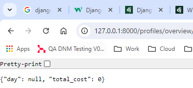
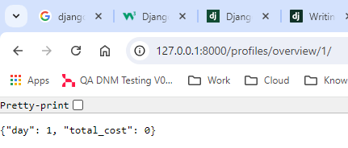
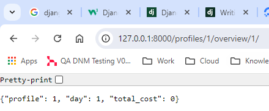

# Solution Journal

## 1. Requirements and Analysis

_Time spent: 3 hours_

### 1.1. Objectives

* [x] Define the product scope 
* [x] Define the user stories
* [x] Define the features

See:
 - [analysis.md](analysis.md)

### 1.2. References

- https://en.wikipedia.org/wiki/Software_development_process

## 2. Define Environment

_Time spent: 1 hour_

### 1.1. Objectives
* [x] Define the programming environment
* [x] Define standards for further contributions
* [x] Define the technology stack

### 1.2. Selection

| Category             | Details                   |
|----------------------|---------------------------|
| Programming Language | Python 3.12.3             |
| Containerization     | Docker 27.1.1             |
| Web Framework        | Django 5.0.7              |
| Python IDE           | PyCharm Community Edition |
| Code style           | PEP-8, Google Doc Strings |
| Linting              | PyCharm built-in linter   |
| Testing              | Unittest                  |
| Version Control      | Git                       |
| Git Hosting          | GitHub                    |
| CI/CD                | GitHub Actions            |
| Documentation        | GitHub Pages, MkDocs      |

## 2. Multi-Processing

_Time spent: 7 hours for research, prototyping and implementation_

### 2.1. Objectives

* [x] Understand the key aspects of the `multiprocessing` module
* [x] Implement a prototype using the `multiprocessing` module


### 2.2. Prototyping

We will concentrate on the implementation of the solution based on the task 
definition. We will use the `multiprocessing` module to simulate multiple 
construction crews working on the wall.
 
The idea is to simulate a CPU bound task where each construction crew is working
to complete a task. In the end, we shall notice a performance improvement when
using multiple processes.

The multiprocessing module allows us to create multiple processes that run
in parallel. Each process will simulate a construction crew working on a
section of the wall. We will use the `Pool` class to create a pool of worker
processes that will work on the wall sections.

```python
from multiprocessing import Pool
import time
import os


def process_section(section):
    print(f"Processing section {section} in process {os.getpid()}")
    time.sleep(1)


def main():
    wall_profiles = [
        [10, 20],
        [10, 5],
        [20, 25]
    ]

    num_processes = 2

    # Get the sections
    sections = []
    for profile in wall_profiles:
        sections.extend(profile)

    # Do the work in parallel on the sections
    with Pool(num_processes) as pool:
        pool.map(process_section, sections)


if __name__ == "__main__":
    main()
```

The `Pool` class takes the number of worker processes as an argument. The 
most common way to create a pool of worker processes is to use the `map` 
method. The `map` method takes a function and an iterable as arguments. The 
function is applied to each element of the iterable using the worker 
processes in the pool.


Another possibility is to use the `starmap` method. The `starmap` method is
similar to the `map` method, but it takes iterable of iterables as an
argument. Each inner iterable is unpacked and passed as arguments to the
function.

```python
from multiprocessing import Pool
import time
import os


def process_section(section, step):
    print(f"Processing section {section} on step {step} in process {os.getpid()}")
    time.sleep(1)
    

def main():
    
    wall_profiles = [
        [10, 20],
        [10, 5],
        [20, 25]
    ]

    num_processes = 2

    # Get the sections
    sections = []
    for profile in wall_profiles:
        sections.extend(profile)

    # Parallel execution of the sections with arguments
    with Pool(num_processes) as pool:
        pool.starmap(process_section, [(section, 1) for section in sections])

if __name__ == "__main__":
    main()
```

### 2.3. References

- https://pymotw.com/3/multiprocessing/index.html
- https://docs.python.org/3/library/multiprocessing.html

## 3. Consistent Logging

_Time spent: 2 hours for reading, prototyping and implementation_

### 3.1. Objectives

* [x] Understand the challenges of logging in a multiprocess environment
* [x] Implement a prototype using the `multiprocessing` module

### 3.2. Challenges

A challenge in the implementation is to log the progress of the construction
crews in a file that is shared between the processes.

> https://docs.python.org/3/howto/logging-cookbook.html#logging-to-a-single-file-from-multiple-processes
>
> Although logging is thread-safe, and logging to a single file from 
> multiple threads in a single process is supported, logging to a single 
> file from multiple processes is not supported. There is no 
> standard way to serialize access to a single file across multiple 
> processes in Python.

### 3.3. Solution

One solution to this problem is to use a `Queue` to pass log messages from the
worker processes to a single process that will write the log messages to a file.
The queue will be handled by a separate process that will read log messages from
the queue and write them to a file.

The `multi_process_logging.py` script contains the implementation of the 
solution. The script uses a queue and a `QueueHandler` that will push the 
log messages to the queue. The `LogListener`process will get the log 
messages from the queue and write them to a file. The file name is fixed in 
the script (pool_logging.log).

Source:
- [/scripts/multi_process_logging.py](../scripts/multi_process_logging.py)

### 3.4. References
- https://stackoverflow.com/questions/13522177/python-multiprocessing-logging-why-multiprocessing-get-logger
- https://pymotw.com/3/multiprocessing/basics.html#logging
- https://docs.python.org/3/library/logging.handlers.html#queuehandler
- https://github.com/getsentry/sentry-python

## 4. Proof of concept

_Time spent: 4 hours for implementation and testing_

### 4.1. Objectives

* [x] Define the proof of concept
* [x] Create a working prototype of the solution with logging
* [x] Test the prototype with different configurations
* [x] Simple positive tests to check the implementation


### 4.2. Definition

In this step, we will create a simple proof of concept to check our 
understanding of the problem. The prototype will be a simple Python 
script that takes the following arguments as python objects: 

- Configration list 
- Number of workers
- Days to calculate

The calculation (building the wall) delay will be simulated by a 
configurable sleep function. By increasing the number of worker processes, we
expect the calculations to be done faster. The total amount of ice and cost
is not affected by the number of workers.

Sources:
- [/scripts/proof_of_concept.py](../scripts/proof_of_concept.py)

## 5. Product Design

_Time spent: 4 hours for implementation_

### 5.1. Objectives

* [x] Define the project structure
* [x] Define diagrams for the system (C4 model)
* [x] Define the CI/CD pipeline

### 5.2. Project Structure

- **assets/** - Contains the images, videos, and other assets used in the project.
- **builder/** - Contains the main implementation of the solution.
  - **tests/** - Contains the tests for the implementation.
- **config/** - Contains the configuration files for the project.
  - **config.ini** - Contains the configuration settings for the project.
- **data/** - Contains the data files for the project.
  - **tracker.log** - Contains the log messages for the project. 
- **docs/** - Contains the documentation for the project.
- **tracker** - Django service to track the progress of the construction crews
- **scripts/** - Contains the scripts used to automate tasks, prototypes, etc.

### 5.3. Design Diagrams

 - [ ] System Context
 - [ ] Containers
 - [ ] Components
 - [ ] Class Diagrams
 - [ ] Data Models

### 5.4. CI/CD Pipeline

- GitHub Actions to run the tests on every push to the main branch
- GitHub Actions to build and push the Docker image to Docker Hub
- GitHub Actions to build the documentation and deploy it to GitHub Pages

### 5.5. References
- https://en.wikipedia.org/wiki/C4_model
- https://c4model.com/img/c4-overview.png


## 6. Django REST API

_Time spent: 12 hours for implementation and testing_

### 6.1. Objectives

* [x] Create a django project
* [x] Create a django application
* [x] Add and route a 'Hello, World!' view
* [x] Add the required views and route them
* [x] Connect the views and the wall builder logic
* [x] Improve the builder simulator
* [ ] Allow configuration from the user
* [ ] Test the views

### 6.2. Create a Django project

A project is a collection of configurations and apps. One project can be 
composed of multiple apps or a single app.

```text
django-admin startproject <replace_with_your_project_name>
```

### 6.3. Start the Django development server

Test the project by running the development server. The development server is
a lightweight web server included with Django. Access the server by
navigating to http://127.0.0.1:8000 in your web browser.

```text
python manage.py runserver
```

### 6.4. Create a new Django app

An app usually is composed of a set of models (database tables), views, 
templates, tests.

| Category | Details                                                                                                                        |
|----------|--------------------------------------------------------------------------------------------------------------------------------|
| model    | A model is a Python class represents a database table.                                                                         | 
| view     | A view is a Python function that takes a web request and returns a web response.                                               |
| template | A template is an HTML file that contains placeholders for dynamic content.                                                     |

```text
python manage.py startapp <replace_with_your_app_name>
```

### 6.5. Add a 'Hello, World!' view

Create a view that returns a simple 'Hello, World!' message.

```python
from django.http import HttpResponse

def hello_world():
    return HttpResponse("Hello, World!")
```

Create a URL pattern that routes the view to the root URL.

```python
from django.urls import path
from profiles import views

urlpatterns = [
  path('', views.home, name='home'),
]
```


### 6.6. Add the required stub views and route them

Add the required views that will just echo the input data. The views will 
later connect to the wall builder simulator.






### 6.7. Connect the views to the wall builder logic

First, we will start to connect the views to the builder logic. As input, we
will take the example in the documentation:

```text
21 25 28
17
17 22 17 19 17
```

The expected output is:

```text
GET /profiles/1/days/1/
RETURNS: {
day: ”1”;
ice_amount: “585”
}

GET /profiles/1/overview/1/
RETURNS: {
day: ”1”;
cost: “1,111,500”
}

GET /profiles/overview/1/
RETURNS: {
day: ”1”;
cost: “3,334,500”
}

GET /profiles/overview/
RETURNS: {
day: None;
cost: “32,233,500”
}
```

Result:
- [Rest_API_routing_test.mp4](..%2Fassets%2Fvideos%2FRest_API_routing_test.mp4)


### 6.8. Improve the builder simulator

After the integration of the views with the builder logic, we will improve the
builder simulator based on some issues found during the previous steps.

- [x] Update both sections and profiles after each calculation
- [x] Add base exception class and extend the error hierarchy
- [x] Add more unit tests to cover all relevant classes

> For unknown reasons, the unit tests are not working as expected. The tests are
> passing, but after the tests something is not closed properly and the test 
> runner hangs. Running the simulator multiple times does not show any 
> problems. The issue is not yet resolved.

### 6.9. Allow configuration from the user

- [x] Handle exceptions in the views
- [x] WallConfigurator class that will import or export the wall configuration
- [x] Extend the REST API to allow the user to configure the wall
- [x] Handle the views with the Django REST framework
- [ ] Provide unit tests for the views

### 6.11. References
- https://simpleisbetterthancomplex.com/series/beginners-guide/1.11/
- https://www.djangoproject.com/
- https://www.django-rest-framework.org/
- https://developer.mozilla.org/en-US/docs/Learn/Server-side/Django
- https://apiguide.readthedocs.io/en/latest/index.html
- https://stackoverflow.blog/2020/03/02/best-practices-for-rest-api-design/
- https://django.cowhite.com/blog/working-with-url-get-post-parameters-in-django/

 
## 7. Containerize the solution

### 7.. References
- https://github.com/cyantarek/django-microservices/blob/master/services/products/api/views.py
- https://github.com/thejungwon/docker-webapp-django/tree/master
- https://github.com/StephenGrider/microservices-casts

## . Documentation

We will use MkDocs to build the documentation. The documentation will be
deployed to GitHub Pages. The documentation will contain at least the following
sections:

1. Problem
2. Solution
3. Installation
4. Rest API
5. CONTRIBUTING.md
6. README.md

## . Create the CI/CD pipeline

We will create a GitHub Actions workflow to run the tests on every push to the
main branch. We will also create a GitHub Actions workflow to build and push the
Docker image to Docker Hub on every release.

What we want:

1. Run the tests on every push to the main branch.
2. Build and push the Docker image to Docker Hub on each push.
3. Build the documentation and deploy it to GitHub Pages in every release.

## . Release

Till now, we were in the pre-development phase. After the tag, changes will be
tracked using concrete issues in the commit messages.


## . Backlog

- Use django models and database for the calculations
- Django REST framework to create the REST API
- Class-based views
- Resolve issue with the unit tests, change the logging solution to pure 
  queue and then save the log in the main process or migrate to concurrent.futures
- Convert WallConfigurator to a dataclass